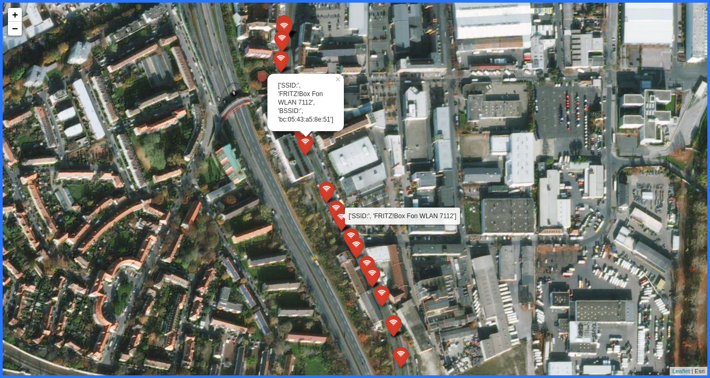

# WiGLE-Visualizer

## Description
[WiGLE](https://www.wigle.net/) is a huge database of 802.11 wireless networks, with statistics, submitted by wardrivers, netstumblers, and net huggers. You can also collect Wardriving Data on your Android phones using the WiGLET Android App Available on [Playstore](https://play.google.com/store/apps/details?id=net.wigle.wigleandroid) [check out alternate download options [here](https://wigle.net/tools)].

This projects helps you visualize your Wardriving data without the need for uploading it to [WiGLE](https://www.wigle.net/) in case you want to keep your wardriving logs private.

## How To Use
```bash
$ git clone https://github.com/whokilleddb/WiGLE-Visualizer
$ cd WiGLE-Visualizer
$ sudo pip3 install -r requirements.txt
```
Now you can run the  `Wiggle_Mapper.ipynb` file in a Jupyter Notebook or run `reqs/Wiggle_Mapper.py` using `ipython`.

Either should result in a `mapdata.html` file in the home folder which contains your Map Data.

## Output
The **Sample Data** can be found [here](https://wigle.net/phpbb/viewtopic.php?t=1670)


